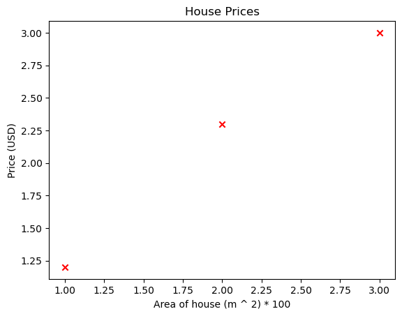

```python
import numpy as np
import matplotlib.pyplot as plt
```


```python
x_train = np.array([1.0, 2.0, 3.0])
y_train = np.array([1.2, 2.3, 3.0])
```


```python
m = x_train.shape[0]
```


```python
plt.scatter(x_train, y_train, marker="x", c="r")
plt.title("House Prices")
plt.xlabel("Area of house (m ^ 2) * 100")
plt.ylabel("Price (USD) * 1000")
plt.show()
```


    

    


```python
def linear_regression_house(x_train, w, b):
    m = x_train.shape[0]
    fwb = np.zeros(m)
    for i in range(m):
        fwb[i] = x_train[i] * w + b
    return fwb
```


```python
w = 1
b = 0.3
```


```python
fwb = linear_regression_house(x_train, w, b)
```


```python
plt.plot(x_train, fwb, c="b", label="Our Prediction Line")
plt.scatter(x_train, y_train, marker="x", c="r", label="Actual Values")
plt.title("Housing Prices")
plt.xlabel("Area of house (m ^ 2) * 100")
plt.ylabel("Price of house (VND) * 1000")
plt.show()
```


    

    


```python

```
